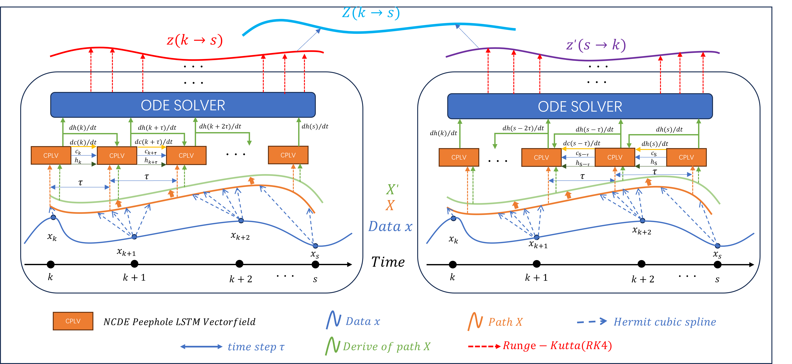

# CPLSTM
A Novel Continuous Peephole LSTM with Neural Controlled Differential Equations for Timely Financial Risk Prediction


## Installing
```
conda env create -f environment.yml
```

## Training code
```
python CPLSTM.py --dataset 'AAPL' --batch 256 --task 'forecasting' --epoch 200 --model 'peepholeLSTM' --seq_len 144 --pred_len 24 --stride_len 1 --alpha 0.9  --lr 0.005 --beta 0.1 --seed 2021 --training 'True' --note '0126' --missing_rate 0 --data_name 'AAPL' --norm 5
```


## Testing code 
```
python CPLSTM.py --dataset 'AAPL' --batch 256 --task 'forecasting' --epoch 200 --model 'peepholeLSTM' --seq_len 144 --pred_len 24 --stride_len 1 --alpha 0.9  --lr 0.005 --beta 0.1 --seed 2021 --training 'False' --note '0126' --missing_rate 0 --data_name 'AAPL' --norm 5
```
If this doesn't work, go to the file CPLSTM.py and uncomment line 524, then execute this command.

